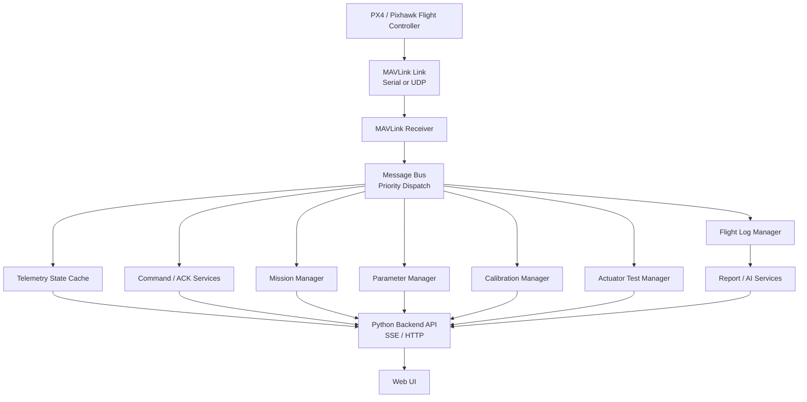

# AeroCentral

Modular PX4 MAVLink Ground Control Station

## Overview

AeroCentral is a local web-based UAV Ground Control Station built around PX4 and MAVLink. It focuses on real-time telemetry, command acknowledgement, mission workflows, parameter safety, sensor calibration, actuator testing, flight-log handling, and engineering-oriented flight analysis.

The project is designed as an engineering prototype and portfolio project. It is not a replacement for certified flight operations software. Any real aircraft operation must be validated with the target flight controller, a safe test environment, propellers removed for ground tests, and an independent reference tool such as QGroundControl.


## Features

- Real-time telemetry dashboard for attitude, compass heading, altitude, airspeed, ground speed, battery, GPS, RC/link status, and MAVLink messages
- MAVLink communication architecture with GCS heartbeat, vehicle heartbeat detection, target system/component identification, COMMAND_ACK, and STATUSTEXT handling
- Mission management with waypoint editing, upload flow, acknowledgement handling, and read-back verification support
- Parameter management with safety gates, whitelist checks, queued writes, and rollback-oriented workflow
- Sensor and aircraft calibration command workflow
- Actuator testing for servo and motor test commands with safety confirmations
- Flight log management for onboard log listing, download status, and local file handling
- Flight log analysis and algorithm-generated engineering reports
- AI-assisted flight analysis and PID advisory when a private API key is configured
- Communication diagnostics for message flow, link status, and backend health


## System Architecture



## Technology Stack

Backend:

- Python
- pymavlink
- pyserial
- Standard-library HTTP server and SSE endpoints

Frontend:

- HTML
- CSS
- JavaScript
- Leaflet for map rendering

Analysis and reporting:

- PX4 ULog parsing utilities
- Local engineering rules
- Optional OpenAI-compatible AI report and PID advisory services

Packaging:

- PyInstaller-based Windows packaging scripts
- Optional Inno Setup installer script

## Project Structure

```text
Ground-Station/
├── backend/                 # Modular MAVLink communication components
│   ├── communication/
│   ├── telemetry/
│   ├── mission/
│   ├── parameters/
│   ├── calibration/
│   ├── actuator/
│   ├── logs/
│   └── reports/
├── services/                # Backend business services and report logic
├── ui_modules/              # Frontend module scripts
├── assets/                  # Public UI assets
├── config/                  # Public default and example configuration
├── docs/                    # Engineering notes and test plans
├── examples/                # Synthetic examples only
├── tests/                   # Automated tests
├── packaging/               # Desktop packaging scripts
├── ground_station_server.py # Main local backend and web server
├── px6c_connector.py        # Backward-compatible MAVLink entrypoint
├── index.html
├── app.js
├── styles.css
├── requirements.txt
├── .env.example
└── .gitignore
```

## Installation

Recommended Python version: 3.11 or 3.12.

```powershell
git clone https://github.com/McDonalds-Scout/AEROCENTRAL-GCS.git
cd AEROCENTRAL-GCS
python -m venv .venv
.\.venv\Scripts\Activate.ps1
python -m pip install --upgrade pip
python -m pip install -r requirements.txt
```

Start the ground station:

```powershell
.\start-ui.cmd
```

Then open:

```text
http://127.0.0.1:8080/
```

## Configuration

Private settings are loaded from `.env`. This file must never be committed.

Create a private environment file from the public example:

```powershell
copy .env.example .env
```

Example:

```env
PORT=8080
MAVLINK_HOST=127.0.0.1
MAVLINK_PORT=14550
MAVLINK_LISTEN_ADDRESS=0.0.0.0
MAVLINK_LISTEN_PORT=14550
MAVLINK_TARGET_PORT=14550
OPENAI_API_KEY=YOUR_API_KEY_HERE
```

Public defaults are also available in:

- `config/default.json`
- `config/example_config.json`

Do not commit real aircraft IP addresses, serial numbers, mission files, GPS coordinates, flight logs, API keys, or company-internal data.

## Safety Design

The project uses several safety boundaries:

- GCS heartbeat is separated from vehicle heartbeat detection.
- Commands are expected to be matched with COMMAND_ACK and relevant STATUSTEXT.
- Dangerous operations require explicit user confirmation.
- AI output is advisory only.
- AI does not directly control the aircraft.
- AI does not modify PID parameters during flight.
- Parameter writes must go through whitelist and human confirmation workflows.
- Real motor and servo tests must be performed with propellers removed.

## Demo Data

The repository does not include real flight logs or real mission data.

Synthetic examples are provided in `examples/`:

- `sample_flight_log_structure.md`
- `sample_config.json`
- `sample_mission.plan`
- `sample_mock_flight.csv`

## Testing

Run the automated tests:

```powershell
python -m unittest discover -s tests -p "test_*.py"
```

Compile-check the core backend:

```powershell
python -m compileall -q ground_station_server.py px6c_connector.py services backend core app
```

## Desktop Packaging

Windows packaging scripts are located in `packaging/windows/`.

Portable build:

```powershell
powershell -NoProfile -ExecutionPolicy Bypass -File .\packaging\windows\build_windows_package.ps1 -SkipInstaller
```

Installer build:

```powershell
powershell -NoProfile -ExecutionPolicy Bypass -File .\packaging\windows\build_windows_package.ps1 -Version 0.1.0
```

Generated build artifacts under `dist/` are ignored and should not be committed.

## Future Development

- More complete desktop application packaging
- Expanded real-flight validation matrix
- Advanced flight analytics and anomaly detection
- Stronger mission planning workflows for fixed-wing and VTOL aircraft
- Improved AI-assisted engineering report review
- More hardware-in-the-loop and software-in-the-loop test coverage

## License

Add a license before publishing the repository publicly.
