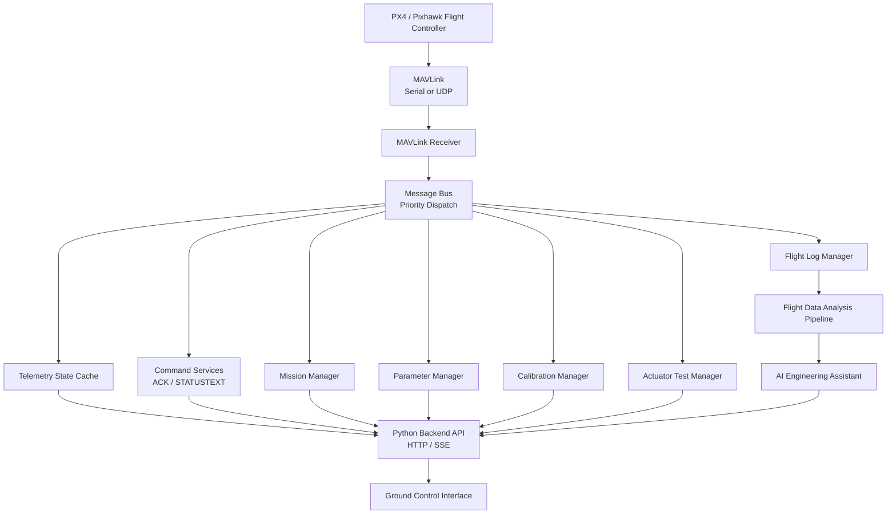

# AeroCentral

A Modular PX4 MAVLink Ground Control Station with AI-Assisted Flight Analysis

## Overview

AeroCentral is a modular UAV Ground Control Station developed for PX4-based aircraft. It integrates real-time telemetry monitoring, MAVLink communication, mission management, parameter workflows, sensor calibration, actuator testing, flight log analysis, and AI-assisted engineering diagnostics.

The goal of this project is to build a professional ground control application for flight operation, engineering testing, and post-flight analysis. It is designed as an engineering prototype and portfolio project, not as certified flight operations software.

Core focus areas:

- UAV operation and ground control workflows
- PX4 / Pixhawk / PX6C MAVLink communication
- Real-time flight testing and telemetry visualization
- Deterministic flight data analysis
- AI-assisted engineering decision support
- Safety-oriented command acknowledgement and human confirmation


## Key Features

### 1. MAVLink Communication Architecture

The system adopts a modular event-driven communication architecture for PX4/Pixhawk-compatible flight controllers.

Supported communication features include:

- Serial and UDP MAVLink connection modes
- GCS Heartbeat generation
- Vehicle Heartbeat monitoring
- Target system and target component identification
- COMMAND_ACK and STATUSTEXT handling
- Message Bus based dispatch for telemetry, command, mission, parameter, calibration, actuator, and log modules
- Communication diagnostics for message rate, link status, and backend health

### 2. Real-Time Flight Monitoring

AeroCentral prioritizes live aircraft operation data instead of generic dashboard metrics.

The main flight interface includes:

- Attitude visualization
- Compass heading display
- GPS position and trajectory tracking
- Altitude, ground speed, and airspeed monitoring
- Battery voltage, current, and remaining capacity
- RC link and channel status
- MAVLink message monitoring
- Real-time warning display
- Flight mode and armed/disarmed status

### 3. Vehicle Management

The system provides core Ground Control Station workflows for engineering testing and aircraft preparation.

Current modules include:

- Mission planning and mission upload workflow
- Parameter reading, editing, safety gates, and rollback-oriented handling
- Sensor and aircraft calibration command workflow
- Servo and motor actuator testing
- Onboard flight log listing and download management
- Flight mode switching and command acknowledgement display

### 4. Flight Log Intelligence

AeroCentral includes automated flight data analysis for PX4 ULog-based engineering review.

The analysis pipeline is:

```text
ULog Flight Data
  -> ULog Parser
  -> Data Validation
  -> Feature Extraction
  -> Engineering Metrics
  -> Flight Phase Analysis
  -> Engineering Report
```

The deterministic analysis layer evaluates:

- Flight performance
- Flight phase segmentation
- Attitude tracking behavior
- Navigation performance
- Battery and power trends
- Actuator behavior
- Sensor and data-quality issues
- Flight anomalies and engineering risks

## AI-Assisted Flight Analysis

The project integrates automated flight data analysis with AI-assisted engineering interpretation.

The AI layer is based on validated engineering metrics generated by deterministic analysis algorithms. It does not directly interpret raw binary logs as an uncontrolled text source. This design reduces hallucination risk and keeps AI output grounded in computed evidence.

AI-assisted analysis can help with:

- Explaining abnormal flight behavior
- Summarizing flight performance
- Highlighting possible causes of issues
- Producing engineering recommendations
- Supporting post-flight review and test iteration

AI does not control the aircraft, does not modify parameters during flight, and does not replace engineering judgement.

## AI Engineering Report Generation

AeroCentral can generate AI-assisted engineering reports from verified flight analysis results.

Reports can include:

- Flight overview
- Mission summary
- Flight phase review
- Performance assessment
- Detected issues
- Possible causes
- Engineering recommendations
- Follow-up test suggestions

The report workflow is designed around a verified summary generated by local algorithms. AI-generated explanations are produced from calculated flight metrics and validated evidence rather than unsupported assumptions.

## AI PID Tuning Assistant

The project includes an AI-assisted PID tuning advisor for engineering review.

Typical analysis inputs include:

- Attitude tracking error
- Overshoot
- Oscillation behavior
- Response delay
- Actuator saturation
- Control performance indicators
- Battery, GPS, and sensor-quality context

Typical outputs include:

- Possible control problems
- Suggested parameter adjustment direction
- Engineering reasoning
- Safety notes before parameter changes

Safety boundary:

- AI does not directly write PX4 parameters.
- AI does not tune PID parameters during flight.
- All recommendations require human review.
- Parameter changes must pass whitelist checks, safety gates, confirmation, and rollback planning.

## System Architecture



## Technology Stack

Backend:

- Python
- pymavlink
- pyserial
- Standard-library HTTP server
- Server-Sent Events for live telemetry updates

Frontend:

- HTML
- CSS
- JavaScript
- Leaflet for map rendering

Communication:

- MAVLink
- Serial MAVLink
- UDP MAVLink

Data processing:

- PX4 ULog analysis pipeline
- Deterministic engineering metrics
- Report generation utilities

AI:

- OpenAI-compatible AI-assisted engineering analysis
- AI Engineering Report generation
- AI PID tuning advisory workflow

Packaging:

- PyInstaller for backend executables
- Electron for desktop application packaging

## Project Structure

```text
Ground-Station/
|-- backend/                 # Modular MAVLink communication components
|   |-- communication/
|   |-- telemetry/
|   |-- mission/
|   |-- parameters/
|   |-- calibration/
|   |-- actuator/
|   |-- logs/
|   `-- reports/
|-- services/                # Backend services, reports, AI, safety, and utilities
|-- ui_modules/              # Frontend module scripts
|-- assets/                  # Public UI assets
|-- config/                  # Public default and example configuration
|-- docs/                    # Engineering documentation and test plans
|-- examples/                # Synthetic examples only
|-- tests/                   # Automated tests
|-- packaging/               # Windows packaging scripts
|-- desktop/                 # Electron desktop application layer
|-- ground_station_server.py # Main local backend and web server
|-- px6c_connector.py        # Backward-compatible MAVLink entrypoint
|-- index.html
|-- app.js
|-- styles.css
|-- requirements.txt
|-- .env.example
`-- .gitignore
```

## Installation

Recommended environment:

- Windows 10 or Windows 11
- Python 3.11 or 3.12
- Git
- Chrome or Edge for Web development mode
- PX4 / Pixhawk / PX6C compatible flight controller for real hardware testing

Install dependencies:

```powershell
git clone https://github.com/McDonalds-Scout/AEROCENTRAL-GCS.git
cd AEROCENTRAL-GCS
python -m venv .venv
.\.venv\Scripts\Activate.ps1
python -m pip install --upgrade pip
python -m pip install -r requirements.txt
```

Start the Web development version:

```powershell
.\start-ui.cmd
```

Then open:

```text
http://127.0.0.1:8080/
```

## Configuration

Private settings are loaded from `.env`. This file must not be committed.

Create a private environment file from the public example:

```powershell
copy .env.example .env
```

Example:

```env
PORT=8080
MAVLINK_HOST=127.0.0.1
MAVLINK_PORT=14550
MAVLINK_LISTEN_ADDRESS=0.0.0.0
MAVLINK_LISTEN_PORT=14550
MAVLINK_TARGET_PORT=14550
OPENAI_API_KEY=YOUR_API_KEY_HERE
```

Public defaults are also available in:

- `config/default.json`
- `config/example_config.json`

Do not commit real aircraft IP addresses, serial numbers, mission files, GPS coordinates, flight logs, API keys, or company-internal data.

## Desktop Application

The Web development mode is preserved through `start-ui.cmd`. The desktop application layer lives in `desktop/electron/` and wraps the existing Python backend and Web UI in an Electron application.

Desktop startup flow:

```text
AeroCentral.exe
  -> starts ground_station_server.exe
  -> waits for /api/version
  -> opens the existing Ground Control Interface in an Electron window
  -> optionally starts MAVLink from app_config.json
```

Build the Windows desktop application:

```powershell
powershell -NoProfile -ExecutionPolicy Bypass -File .\desktop\electron\build_desktop_windows.ps1 -Version 0.1.0
```

Generated desktop files:

```text
dist\desktop\AeroCentral Setup 0.1.0.exe
dist\desktop\AeroCentral 0.1.0.exe
dist\desktop\win-unpacked\AeroCentral.exe
```

Smoke test the packaged application:

```powershell
.\dist\desktop\win-unpacked\AeroCentral.exe --smoke-test
```

## Testing

Run automated tests:

```powershell
python -m unittest discover -s tests -p "test_*.py"
```

Compile-check the core backend:

```powershell
python -m compileall -q ground_station_server.py px6c_connector.py services backend core app
```

## Safety Design

AeroCentral uses several safety boundaries:

- Commands must be verified with COMMAND_ACK and relevant STATUSTEXT.
- Dangerous operations require explicit user confirmation.
- Motor and servo tests must be performed with propellers removed.
- AI output is advisory only.
- AI does not directly control the aircraft.
- AI does not modify PID parameters during flight.
- Parameter writes must go through whitelist and human confirmation workflows.
- Real aircraft operation must be validated against the target flight controller and a trusted reference tool such as QGroundControl.

## Demo Data

This repository does not include real flight logs or real mission data.

Synthetic examples are provided in `examples/`:

- `sample_flight_log_structure.md`
- `sample_config.json`
- `sample_mission.plan`
- `sample_mock_flight.csv`

## Future Development

- Update the English version
- Desktop application release workflow
- Advanced AI flight assistant
- Automated parameter optimization support
- Multi-vehicle operation support
- Cloud-based flight analytics
- Expanded hardware-in-the-loop and software-in-the-loop validation
- More complete fixed-wing and VTOL mission templates

## License

This project is licensed under the Apache License 2.0. See [LICENSE](LICENSE) for details.
