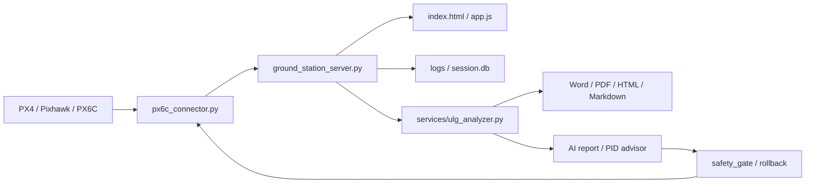

# 项目结构说明

本项目采用“本地 Web UI + Python 后端 + MAVLink 连接进程 + 服务模块”的结构。前端负责显示和交互，后端负责 API、日志、报告、AI、飞控连接和安全控制。

## 顶层文件

| 文件 | 作用 |
|---|---|
| `index.html` | 前端页面结构，包含主界面、连接设置、任务规划、报告、调参等页面入口 |
| `app.js` | 前端主逻辑，负责页面切换、接口请求、地图、姿态仪、罗盘、HUD、告警和实时数据渲染 |
| `styles.css` | 前端视觉样式，包含深色主题、面板布局、仪表、地图和按钮样式 |
| `ground_station_server.py` | 主后端入口，提供静态页面、`/api/` 接口、SSE 推送、连接进程管理 |
| `px6c_connector.py` | MAVLink 连接主程序，负责 USB / UDP、消息解析、命令发送、任务上传和飞控 target 识别 |
| `requirements.txt` | Python 依赖 |
| `start-ui.cmd` / `start-ui.ps1` | 推荐启动入口 |
| `cleanup-ui.ps1` | 清理旧后台和端口占用 |
| `ensure-dependencies.ps1` / `ensure_dependencies.py` | 自动检查和安装 Python 依赖 |

## 主要目录

| 目录 | 作用 | 是否进入 GitHub |
|---|---|---|
| `services/` | 后端业务模块，包含 AI、报告、MAVLink、校准、安全门、回滚、日志分析 | 是 |
| `core/` | 核心状态模型，例如飞控状态和遥测状态 | 是 |
| `app/` | 应用级安全逻辑和辅助模块 | 是 |
| `config/` | AI 模型、价格、PID 白名单、报告机型等配置 | 是 |
| `prompts/` | AI 报告、AI 调参、最终复核等提示词 | 是 |
| `tests/` | 自动化测试 | 是 |
| `docs/` | 工程文档和测试矩阵 | 是 |
| `assets/` | Logo、地图等静态资源 | 是 |
| `vendor/` | 第三方前端库，例如 Leaflet | 是 |
| `mock/` | Mock 示例数据 | 是 |
| `android-web-browser-app/` | Android WebView 包装实验工程 | 是，不包含本地构建工具 |
| `logs/` | 实时飞行记录 | 否 |
| `uploads/` | 上传的 `.ulg` 日志 | 否 |
| `downloads/` | 下载的飞控日志或临时文件 | 否 |
| `reports/` | 生成的 Word / PDF / HTML / Markdown 报告 | 否 |
| `outputs/` | 生成输出和临时产物 | 否 |
| `commands/` | 运行时命令队列和状态 | 只保留目录，不提交运行状态 |

## 后端模块说明

| 模块 | 作用 |
|---|---|
| `services/mavlink_gcs.py` | GCS heartbeat、飞控 heartbeat 过滤、source / target 身份 |
| `services/mavlink_command_status.py` | 命令状态、COMMAND_ACK 状态分类、命令队列过期保护 |
| `services/aircraft_calibration_service.py` | 飞机/传感器校准会话、安全确认、PX4 文本翻译 |
| `services/rc_link_analyzer.py` | RC 链路、RSSI、通道健康、更新率诊断 |
| `services/rc_calibration_engine.py` | 遥控器校准采样、映射和参数建议 |
| `services/ulg_analyzer.py` | `.ulg` 解析、算法工程报告、图表和导出 |
| `services/report_reliability.py` | verified_summary、异常过滤、报告可信度控制 |
| `services/report_data_builder.py` | 报告结构化底稿、机型识别和阶段分析 |
| `services/ai_report_service.py` | AI 工程报告生成 |
| `services/ai_pid_advisor.py` | 本地工程规则 PID 建议 |
| `services/llm_pid_advisor.py` | OpenAI / ChatGPT PID 建议 |
| `services/safety_gate.py` | 参数写入和危险操作安全门 |
| `services/rollback_manager.py` | PID 参数回滚快照 |
| `services/session_logger.py` | 实时遥测记录 |
| `services/version_info.py` | 前后端版本、build hash 和缓存诊断 |

## 数据流

## 开发边界

- 前端显示和交互优先放在 `app.js`，后续较大功能应继续拆到 `ui_modules/`。
- 后端 API 调度放在 `ground_station_server.py`。
- MAVLink 协议细节优先拆到 `services/mavlink_*.py`。
- 日志报告和 AI 分析不要写进飞控连接主循环。
- 高风险命令必须经过安全门、命令状态、COMMAND_ACK、STATUSTEXT 和超时处理。

## 不应提交的内容

以下内容只属于本地运行环境，不应提交 GitHub：

- `.env`
- `.ulg` 飞行日志
- `logs/`
- `uploads/`
- `downloads/`
- `reports/`
- `outputs/`
- `connection.log`
- Android `.build-tools/`
